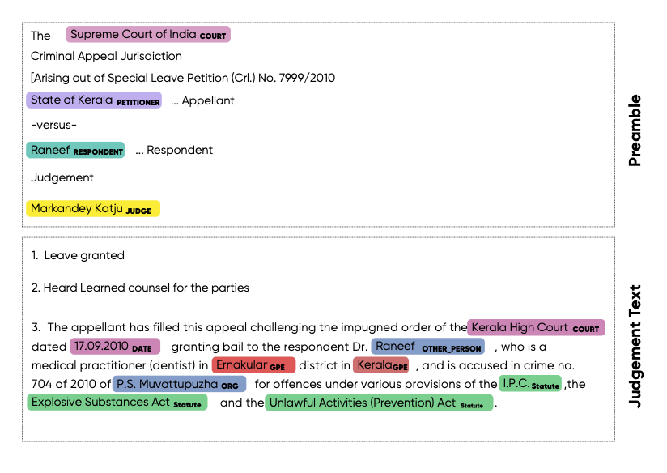

Which Legal Named Entities are extracted?
==============================
Named Entities Recognition is commonly studied problem in Natural Language Processing and many pre-trained models are publicly available. However legal documents have peculiar named entities like names of petitioner, respondent, court, statute, provision, precedents, etc. These entity types are not recognized by standard Named Entity Recognizer like spacy. Hence there is a need to develop a Legal NER model. Due to peculiarity of Indian legal processes and terminologies used, it is important to develop separate legal NER for Indian court judgment texts.

Some entities are extracted from Preamble of the judgements and some from judgement text. Preamble of judgment contains formatted metadata like names of parties, judges, lawyers,date, court etc. The text following preamble till the end of the judgment is called as the "judgment". Below is an example

Following legal entities are extracted from input court judgment.

 =============== ===================== ====================================================================================================================================================================== ===
  Named Entity    Extract From          Description
 =============== ===================== ====================================================================================================================================================================== ===
  COURT           Preamble, Judgment    Name of the court which has delivered the current judgement if extracted from Preamble. Name of any court mentioned if extracted from judgment sentences.
  PETITIONER      Preamble, Judgment    Name of the petitioners / appellants /revisionist  from current case
  RESPONDENT      Preamble, Judgment    Name of the respondents / defendents /opposition from current case
  JUDGE           Premable, Judgment    Name of the judges from current case  if extracted from preamble. Name of the judges of the current as well as previous cases if extracted from judgment sentences.
  LAWYER          Preamble              Name of the lawyers from both the parties
  DATE            Judgment              Any date mentioned in the judgment
  ORG             Judgment              Name of organizations mentioned in text apart from court. E.g. Banks, PSU, private companies, police stations, state govt etc.
  GPE             Judgment              Geopolitical locations which include names of countries,states,cities, districts and villages
  STATUTE         Judgment              Name of the act or law mentioned in the judgement
  PROVISION       Judgment              Sections, sub-sections, articles, orders, rules under a statute
  PRECEDENT       Judgment              All the past court cases referred in the judgement as precedent. Precedent consists of party names + citation(optional) or case number (optional)
  CASE\_NUMBER    Judgment              All the other case numbers mentioned in the judgment (apart from precedent) where party names and citation is not provided
  WITNESS         Judgment              Name of witnesses in current judgment
  OTHER_PERSON    Judgment              Name of the all the person that are not included in petitioner,respondent,judge and witness
 =============== ===================== ====================================================================================================================================================================== ===

More detailed definitions with examples can be found `here <https://docs.google.com/presentation/d/e/2PACX-1vSpWE_Qk9X_wBh7xJWPyYcWcME3ZBh_HmqeZOx58oMLyJSi0Tn0-JMWKI-HsQIRuUTbQHPql6MlU7OS/pub?start=false&loop=false&delayms=3000>`_
For more details about training data and code used for training , please refer to `legal_NER git repo <https://github.com/Legal-NLP-EkStep/legal_NER>`_.

Extract Named Entities from Judgment Text
======================
Use following python to extract entities from single court judgment. For running all 3 AI models together on input text, please refer :ref:`here<Run All 3 AI models on Input Judgment Texts>`.

.. code-block:: python

    import opennyai.ner as InLegalNER
    from opennyai.utils import Data
    import urllib

    ###### Get court judgment texts on which to run the AI models
    text1 = urllib.request.urlopen('https://raw.githubusercontent.com/OpenNyAI/Opennyai/master/samples/sample_judgment1.txt').read().decode()
    text2 = urllib.request.urlopen('https://raw.githubusercontent.com/OpenNyAI/Opennyai/master/samples/sample_judgment2.txt').read().decode()
    texts_to_process = [text1,text2] ### you can also load your text files directly into this
    data = Data(texts_to_process)  #### create Data object for data  preprocessing before running ML models

    pipeline = Pipeline(components=['NER'], use_gpu=use_gpu, verbose=True,ner_model_name='en_legal_ner_trf',
                 ner_mini_batch_size=40000, ner_do_sentence_level=True, ner_do_postprocess=True,
                 ner_statute_shortforms_path='')

    results = pipeline(data)

    json_result_doc_1 = results[0]

    ner_doc_1 = pipeline._ner_model_output[0]

    identified_entites = [(ent, ent.label_) for ent in ner_doc_1.ents]

Output of NER model is a spacy doc and identified_entities is list of entities extracted.

.. code-block:: python

    [(Section 319, 'PROVISION'),
     (Cr.P.C., 'STATUTE'),
     (G. Sambiah, 'RESPONDENT'),
     (20th June 1984, 'DATE')]

Important parameters while loading NER model
--------------------
* ner_model_name (string): Accepts a model name of spacy as InLegalNER that will be used for NER inference available models are 'en_legal_ner_trf', 'en_legal_ner_sm'. 'en_legal_ner_trf' has best accuracy but can be slow, on the other hand 'en_legal_ner_sm' is fast but less accurate.

* use_gpu (bool): Functionality to give a choice whether to use GPU for inference or not. Setting it True doesn't ensure GPU will be utilized it need proper support libraries as mentioned in documentation

Important parameters while inferring NER model
--------------------
* ner_do_sentence_level (bool): To perform inference at sentence level or not, at sentence level it better accuracy. We recommend setting this to True.

* ner_do_postprocess (bool): To perform post-processing over processed doc. We recommend to set this to True.

* ner_statute_shortforms_path(path):It is the path of the csv file if the user wants to provide predefined shortforms to create statute clusters.The csv should have 2 columns namely 'fullforms' and 'shortforms' where 'fullforms' contain the full name of the statute eg. 'code of criminal procedure' and shortforms contain the acronym that can be present in the judgment eg.'crpc'.Each row represents a fullform,shortform pair.

* ner_mini_batch_size (int): This accepts an int as batch size for processing of a document, if length of document is bigger that given batch size it will be chunked and then processed.

* verbose (bool): Set it to if you want to see progress bar while processing happens

Post Processing of extracted Named Entities
======================
Since the document level context was not used duiring annotation,it is important to capture the document level context while inference. This can be done via postprocessing using rules.

To perform postprocessing on the extracted entities specify `ner_do_postprocess=True`.

The postprocessing is done on these entities:

1. `Precedents`: Same precedent can be written in multiple forms in a judgment. E.g. with citation,without
citation,only petitioner's name supra etc.For eg. 'darambir vs state of maharashtra 2016 AIR 54','darambir vs state of maharashtra 'and'darambir's case(supra)' all refer to the same case.All the precedents referring to the same case
are  clustered together and the longest precedent in the cluster is the head of the cluster.The output is a dict where the keys are the head of the cluster (longest precedent) and value
is a list of all the precedents in that cluster. To access the list, use

`ner_doc_1.user_data['precedent_clusters']`

For example
 [{Madhu Limaye v. State of Mahrashtra: [Madhu Limaye v. State of Mahrashtra, Madhu Limaye v. State of Maharashtra, Madhu Limaye, Madhu Limaye, Madhu Limaye]}]

2. `Statute`: In a judgment,sometimes aconyms are used instead of the complete statute name.For eg.section 147 of  IPC,section 148 of Penal code is mentioned instead of Indian Penal code.We have incorporated the acronyms for some well known statutes such as IPC,CrPC,Income Tax act,Motor vehicles act,sarfaesi etc.All the statutes which are a short form of any of these well known statute belongs to the same cluster.For eg I.P.C,IPC,Penal code will belong to the same cluster with head as "Indian Penal code".
Many a times,the way a statute is referred within a judgment is explicitly mentioned .For eg. Motor Vehicle Act(herein referred as MV act).
So,every mention of MV act would belong to the same cluster with head as "Motor Vehicle Act". .It can be
used by:

`ner_doc_1.user_data['statute_clusters']`

For example:
{ 'Criminal Procedure Code': [Code of Criminal Procedure,Crpc] }

3. `Provision-Statute`: Every provision should have an associated statute.Sometimes the provision is followed by the statute it belongs to and   sometimes the
corresponding statutes are not mentioned explicitly .To find statutes for these implicit provisions,we search the judgment if the same provision is mentioned elsewhere along with the statute,if present we assign the same statute to the implicit provision.If not,the nearest statute prior to the provision is assigned to that provision after some validations.The statutes assogned are then normalised using the statute clusters
The output is a list of named tuples, each tuple contains provision-statute-normalised provision-normalised statutes text eg. (362,IPC,'Section 362','Indian Penal Code') .It can be
used by:

`ner_doc_1.user_data['provision_statute_pairs']`

For example
[(Section 369, Crpc, 'Section 369','Criminal Procedure Code'), (Section 424, Crpc, 'Section 424','Criminal Procedure Code')]

4. `Other person/Org` : Same entities can be tagged with different classes in different sentences of
the same judgment due to sentence level context. E.g. 'Amit Kumar' can be  a petitioner
in the preamble but later in the judgment is marked as 'other_person'. So,we reconcile these entities
based on their relative importance i.e. 'Amit Kumar' will be marked as petitioner in the
whole judgment.

Visualization of extracted Named Entities
======================
To visualize the NER result on single judgment text please run

.. code-block:: python

    from spacy import displacy
    from opennyai.ner.ner_utils import ner_displacy_option
    displacy.serve(ner_doc_1, style='ent',port=8080,options=ner_displacy_option)

Please click on the link displayed in the console to see the annotated entities.

Getting unique provisions,statutes and precedents 
======================

1. To get a list of unique precedents within a judgment:

.. code-block:: python

    from opennyai.ner import get_unique_precedent_count
    precedents=InLegalNER.get_unique_precedent_count(ner_doc_1)
    
It will return a dictionary with name of the precedents  as keys and number of times they occured as values.
 For eg. State of Punjab v. Phil  and Anr: [State of Punjab v. Phil Rani and Anr, Phil ]
    
    
2. To get frequency count of all the provisions within a judgment:

.. code-block:: python

    from opennyai.ner import get_unique_provision_count
    provisions=get_unique_provision_count(ner_doc_1)
    
It will return a dictionary with name of the provisions as keys and number of times they occured as values.
 For eg.{'Article 226 of Constitution': 11, 'Article 227 of Constitution': 12}
 
3. To get frequency count of all the statutes within a judgment:

.. code-block:: python

    from opennyai.ner import get_unique_statute_count
    statutes=get_unique_statute_count(ner_doc_1)

It will return a dictionary with name of the statutes as keys and number of times they occured as values.
 For eg.{'Constitution': 30, 'Criminal Procedure Code': 77, 'Indian Penal Code': 13}
    

Storing extracted Named Entities to a file
======================
1. To save result in csv file with linked entities :

.. code-block:: python

    from opennyai.ner import get_csv
    get_csv(ner_doc_1,file_name,save_path):
In the created csv,it will have 4 columns namely:

'file_name': name of the file/judgment

'entity': The entity found in the judgment .For eg.'section 482' ,'constiution','sibbia vs ajay'

'label': The label associated with each entity .For eg. label of 'section 482' would be 'provision'

'normalised entities': Entities including provision,statute and precedents are normalised as follows:

1.'Provision': Each provision is normalised by adding the statute associated with it alongside. For eg.'section 147' is normalised to 'Section 147 of Indian Penal Code'

2.'Statute': Each statute is normalised by adding its full form if present .For eg.'IPC' is normalised to 'Indian Penal Code'

3.'Precedent': Each precedent is normalised by checking if the particular precedent is mentioned elsewhere in the judgment and is longer than the current precent(has citations,full names etc.). For eg. normalised entity for 'amber v. State of Haryana' would be 'amber v. State of Haryana R.C.R. (Crl.)2007' 

Huggingface Models
======================
These models are also published on huggingface

`en_legal_ner_trf <https://huggingface.co/opennyaiorg/en_legal_ner_trf>`_ and `en_legal_ner_sm <https://huggingface.co/opennyaiorg/en_legal_ner_sm>`_
