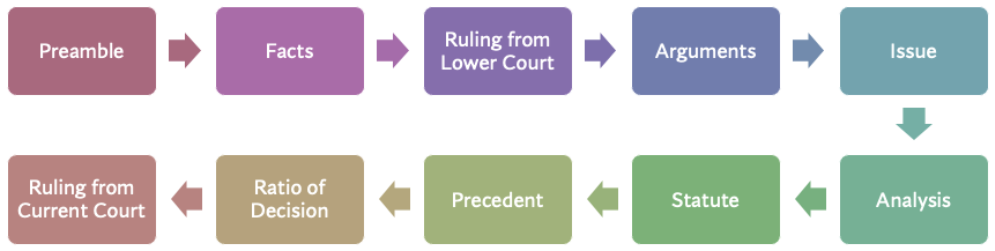

Structuring Court Judgments using Sentence Rhetorical Roles
============================
Indian Court Judgements have an inherent structure which is not explicitly mentioned in the judgement text. Assigning rhetorical roles to the sentences provides structure to the judgements. This is an important step which will act as building block for developing Legal AI solutions.
Though there is no prescription for writing judgement,a judgement text follows an inherent structure. For example, a judgement text would begin with preamble, state facts of the case, courts analysis of the arguments from respondents and petitioners etc. Typical structure of an Indian court judgement is as shown below. The flow is not linear and these roles can appear in any sequence.

The detailed definitions of each of the rhetorical roles is specified below

 =========================================== =================================================================================================================================================================================================================================================================================================================================================================================================================================================================================================================================================================================================================
  Rhetorical Role                             Rhetorical Roles (sentence level)
 =========================================== =================================================================================================================================================================================================================================================================================================================================================================================================================================================================================================================================================================================================================
  Preamble (PREAMBLE)                      A typical judgement would start with the court name, the details of parties, lawyers and judges' names, Headnotes. This section typically would end with a keyword like (JUDGEMENT or ORDER etc.) Some supreme court cases also have HEADNOTES, ACTS section. They are also part of Preamble.
  Facts(FAC)                                  This refers to the chronology of events (but not judgement by lower court) that led to filing the case, and how the case evolved over time in the legal system (e.g., First Information Report at a police station, filing an appeal to the Magistrate, etc.) Depositions and proceedings of current court Summary of lower court proceedings
  Ruling by Lower Court (RLC)                 Judgments given by the lower courts (Trial Court, High Court) based on which the present appeal was made (to the Supreme Court or high court). The verdict of the lower Court, Analysis & the ratio behind the judgement by the lower Court is annotated with this label.
  Issues (ISSUE)                              Some judgements mention the key points on which the verdict needs to be delivered. Such Legal Questions Framed by the Court are ISSUES. E.g. “he point emerge for determination is as follow:- (i) Whether on 06.08.2017 the accused persons in furtherance of their common intention intentionally caused the death of the deceased by assaulting him by means of axe ?”
  Argument by Petitioner (ARG\_PETITIONER)    Arguments by petitioners' lawyers. Precedent cases argued by petitioner lawyers fall under this but when court discusses them later then they belong to either the relied / not relied upon category. E.g. “learned counsel for petitioner argued that …”
  Argument by Respondent (ARG\_RESPONDENT)    Arguments by respondents lawyers. Precedent cases argued by respondent lawyers fall under this but when court discusses them later then they belong to either the relied / not relied upon category. E.g. “learned counsel for the respondent argued that …”
  Analysis (ANALYSIS)                         Courts discussion on the evidence,facts presented,prior cases and statutes. These are views of the court. Discussions on how the law is applicable or not applicable to current case. Observations(non binding) from court. It is the parent tag for 3 tags: PRE\_RLEIED, PRE\_NOT\_RELIED and STATUTE i.e. Every statement which belong to these 3 tags should also be marked as ANALYSIS  E.g. “Post Mortem Report establishes that .. “ E.g. “In view of the abovementioned findings, it is evident that the ingredients of Section 307 have been made out ….”
  Statute (STA)                               Text in which the court discusses Established laws, which can come from a mixture of sources – Acts , Sections, Articles, Rules, Order, Notices, Notifications, Quotations directly from the bare act, and so on. Statute will have both the tags Analysis + Statute  E.g. “Court had referred to Section 4 of the Code, which reads as under: "4. Trial of offences under the Indian Penal Code and other laws.-- (1) All offences under the Indian Penal Code (45 of 1860) shall be investigated, inquired into, tried, and otherwise dealt with according to the provisions hereinafter contained”
  Precedent Relied (PRE\_RELIED)              Sentences in which the court discusses prior case documents, discussions and decisions which were relied upon by the court for final decisions. So Precedent will have both the tags Analysis + Precedent E.g. This Court in Jage Ram v. State of Haryana3 held that: "12. For the purpose of conviction under Section 307 IPC, ….. “
  Precedent Not Relied (PRE\_NOT\_RELIED)     Sentences in which the court discusses prior case documents, discussions and decisions which were not relied upon by the court for final decisions. It could be due to the fact that the situation in that case is not relevant to the current case. E.g. This Court in Jage Ram v. State of Haryana3 held that: "12. For the purpose of conviction under Section 307 IPC, ….. “
  Ratio of the decision (Ratio)               Main Reason given for the application of any legal principle to the legal issue. This is the result of the analysis by the court. This typically appears right before the final decision. This is not the same as “Ratio Decidendi” taught in the Legal Academic curriculum. E.g. “The finding that the sister concern is eligible for more deduction under Section 80HHC of the Act is based on mere surmise and conjectures also does not arise for consideration.”
  Ruling by Present Court (RPC)               Final decision + conclusion + order of the Court following from the natural / logical outcome of the rationale E.g. “In the result, we do not find any merit in this appeal. The same fails and is hereby dismissed.”
  NONE                                        If a sentence does not belong to any of the above categories E.g. “We have considered the submissions made by learned counsel for the parties and have perused the record.”
 =========================================== =================================================================================================================================================================================================================================================================================================================================================================================================================================================================================================================================================================================================================

For more details about how the data was collected and model training , please refer to  the `paper <http://www.lrec-conf.org/proceedings/lrec2022/pdf/2022.lrec-1.470.pdf>`_ and `git repo <https://github.com/Legal-NLP-EkStep/rhetorical-role-baseline>`_.

Predict Rhetorical Roles
================
Use following python to get structure of 2 court judgments using sentence rhetorical roles. For running all 3 AI models together on input text, please refer :ref:`here<Run All 3 AI models on Input Judgment Texts>` .

.. code-block:: python

    from opennyai import RhetoricalRolePredictor
    from opennyai.utils import Data
    import urllib

    ###### Get court judgment texts on which to run the AI models
    text1 = urllib.request.urlopen('https://raw.githubusercontent.com/OpenNyAI/Opennyai/master/samples/sample_judgment1.txt').read().decode()
    text2 = urllib.request.urlopen('https://raw.githubusercontent.com/OpenNyAI/Opennyai/master/samples/sample_judgment2.txt').read().decode()
    texts_to_process = [text1,text2] ### you can also load your text files directly into this
    data = Data(texts_to_process)  #### create Data object for data  preprocessing before running ML models

    pipeline = Pipeline(components=['Rhetorical_Role'], use_gpu=use_gpu, verbose=True)

    results = pipeline(data)

    json_result_doc_1 = results[0]
